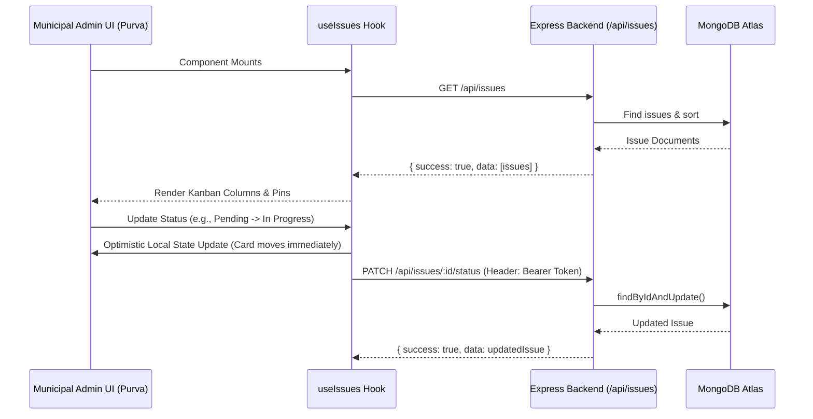

# Application Flow

## Current Status
- Backend (Amey - 100 series): In Progress
- App Shell / Auth (Tanmay - 200 series): In Progress
- Citizen Submission (Janhavi - 300 series): In Progress
- Municipal Admin Dashboard (Purva - 400 series): Implemented

---

## 400 Series — Purva (Municipal Admin Dashboard)

### 401. Issues Fetching & Optimistic Kanban Update Flow
1. Municipal official accesses the `/admin` route handled by `frontend/purva/components/AdminDashboard.jsx`.
2. On mount, `useIssues.js` fires `GET /api/issues`.
3. Issues are distributed into 3 status columns: `Pending`, `In Progress`, and `Resolved`.
4. When status is altered via the detail modal, `updateIssueStatus` immediately reflects the new column locally (optimistic update) and dispatches `PATCH /api/issues/:id/status` with `Authorization: Bearer <jwt_token>` in the background.

### 402. Leaflet Map Markers & Spatial Coordinates Flow
1. `MapView.jsx` initializes a Leaflet `MapContainer` centered on Ranchi, Jharkhand (`[23.3441, 85.3096]`, zoom 13).
2. MongoDB GeoJSON format coordinates `location.coordinates: [longitude, latitude]` are parsed and converted to Leaflet's `[latitude, longitude]` structure `[coordinates[1], coordinates[0]]`.
3. Markers are populated dynamically on the map layer with category tags, status, and thumbnails.
4. Clicking a marker popup's action button triggers `onMarkerClick` to open the full `IssueModal`.

### 403. Issue Status Update Modal Flow
1. Clicking any `IssueCard` or Map marker sets `selectedIssue` and opens `IssueModal.jsx`.
2. Modal presents full image preview, description, formatted Indian timestamp, coordinates, category badge, and severity border.
3. Authority chooses a new status from the dropdown and clicks **Save Changes**.
4. Triggers `updateIssueStatus(id, newStatus)` and closes modal seamlessly.

